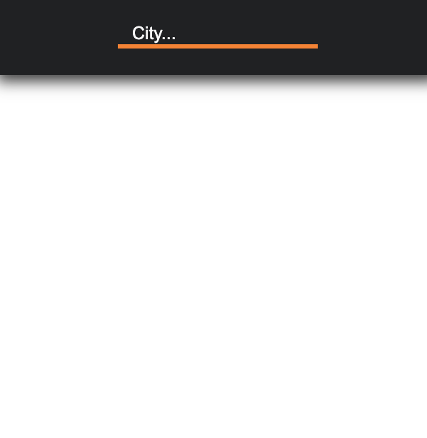
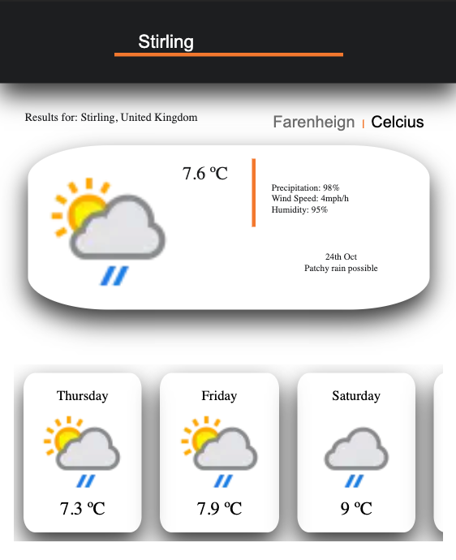
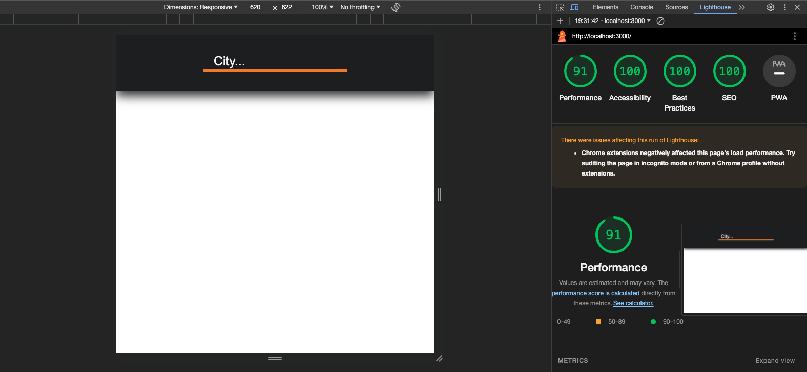

# weather-api
Next.js app which fetch weather forecast of 5 days from www.weatherapi.com for the city requested.

The app has a simple design in black and white with a little bit of orange.

## ScreenShots of the app
<table>
  <tr>
    <td style="border: 4px solid black; padding: 10px;" align="center" margin="4px">
      
       Home Page Viewing
    </td>
    <td style="border: 4px solid black; padding: 10px;" align="center"; margin="4px">
      
       Forecast Viewing
    </td>
  </tr>
</table>

## Testing:

- **Lighthouse Test**: The app has been tested with Lighthouse to optimize its performance.

- **Axe DevTools**: Accessibility testing has been performed using Axe DevTools.

- **Unit Testing**: All components have undergone individual testing with Jest.

- **End-to-End Testing**: Cypress has been used for e2e testing.

## To run this app:

1. Clone the repository and open it in your preferred source code editor.
2. Open your terminal and navigate to the project folder: cd waether-api/my-app
3. Install the necessary dependencies: npm install
4. Run: npm run build
4. Run the client application: npm start
